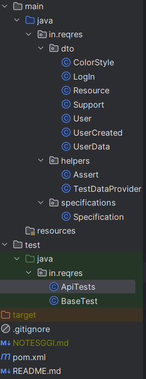
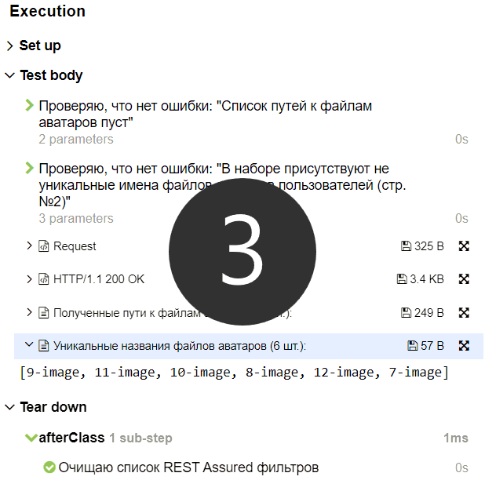

## Содержание
[Краткий обзор](#краткий-обзор)
- [Структура проекта](#задание-1)
- [Код](#код)
- [Отчеты](#отчеты)

[Задания](#задания)
- [Задание 1](#задание-1)
- [Задание 2](#задание-2)
- [Задание 3](#задание-3)
- [Задание 4](#задание-4)

[Требования](#требования)
- [Стек](#стек)
- [Прочее](#прочее)

## Краткий обзор
### Структура проекта
Использовался холиварный прием с размещением хелперов, пэйдж обджектов и прочего 
в директории main:

PS. На скрине можно заметить файл NOTESGGI.md (личные заметки по проекту).
Он отсутствует в удаленном репозитории, команда "git status" на него не реагирует,
и его упоминание не замусоривает .gitignore, 
т.к. он отсеивается глобальным .gitignore файлом. Крутая git-фича.
### Код
На мой взгляд [методы](src/test/java/in/reqres/ApiTests.java) получились прилично нагруженными бойлерплейтом - 
в угоду информативности allure-отчетов.
### Отчеты
По каждому тесту отчеты выглядят примерно так:

## Задания

### Задание 1
Используя сервис [reqres.in](https://reqres.in/) получить список пользователей со второй страницы.
Убедится что  имена файлов аватаров пользователей уникальны

### Задание 2
Используя сервис [reqres.in](https://reqres.in/) протестировать авторизацию пользователя в системе.
Необходимо создание двух тестов на успешный логин и логин с ошибкой из-за не введённого пароля

### Задание 3
Используя сервис [reqres.in](https://reqres.in/) убедится что операция LIST <RESOURCE> возвращает
данные отсортированные по годам

### Задание 4
Используя сервис [gateway.autodns.com](https://gateway.autodns.com/) убедиться, что количество тегов равно 14.

## Требования
### Стек
Java, testNG, restAssured.
### Прочее
- [x] Помник параметризован
- [x] Хотя бы в одном тесте используются спецификации
- [x] В тестах [1](#задание-1), [2](#задание-2) и [3](#задание-3) используются дата-классы
- [x] Разбивка на степы по желанию
- [x] Каждый тест должен проверять условия, согласно заданию, следовательно содержать ассерт
- [x] Если тест содержит параметры, тест должен быть параметризован. Допустима параметризация
стандартными средствами TestNG: датапровайдором, либо xml-файлом
- [x] Пожалуйста внимательно читайте задание!
- [x] Пожалуйста проверяйте свои проверки! Тест должен корректно проверять функционал, при
любом ответе сервера! Условие не соблюдается - ассерт выдаёт ошибку
